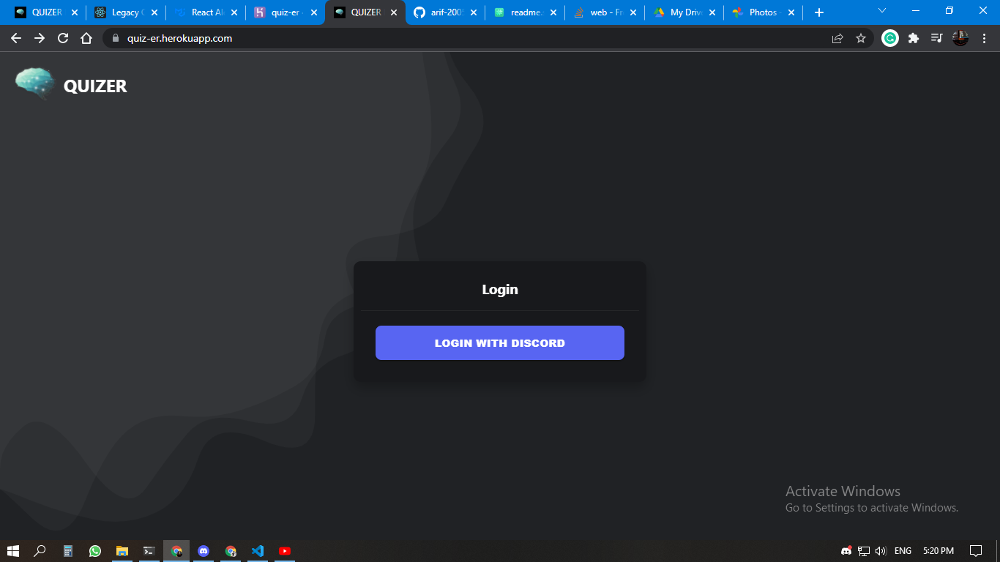
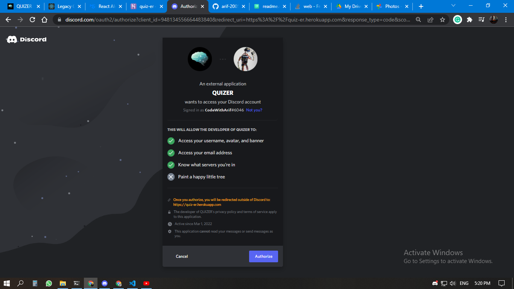
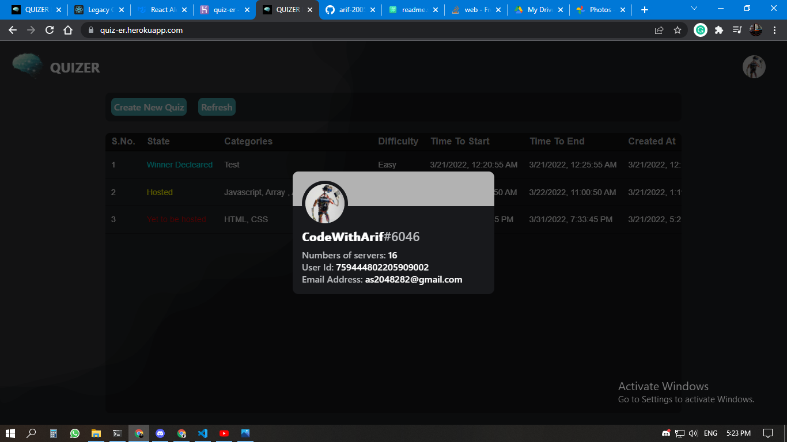
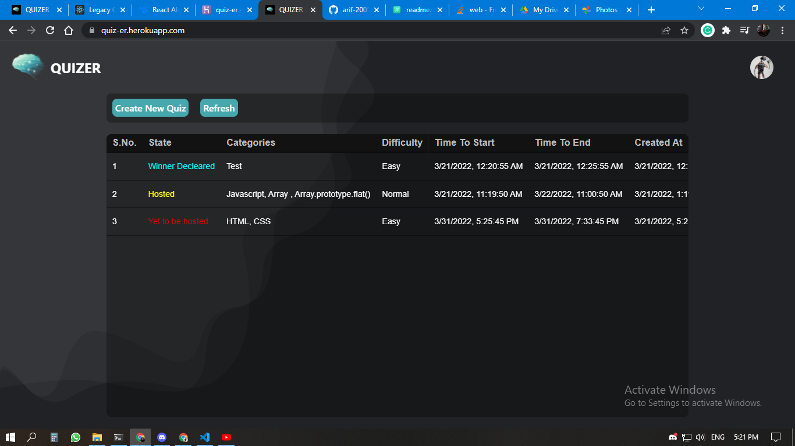
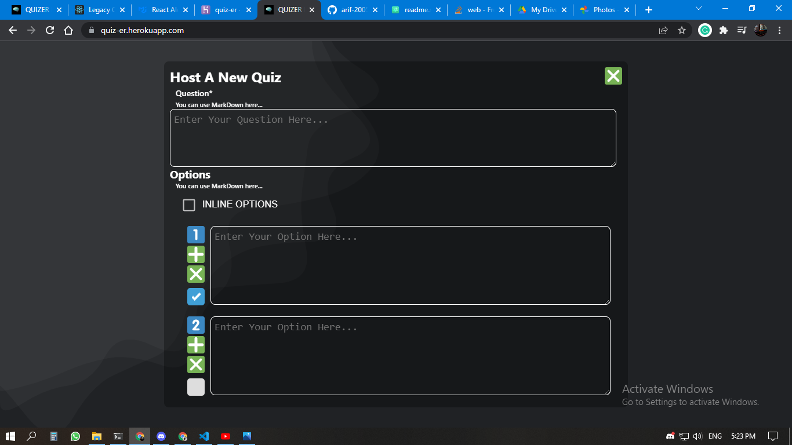
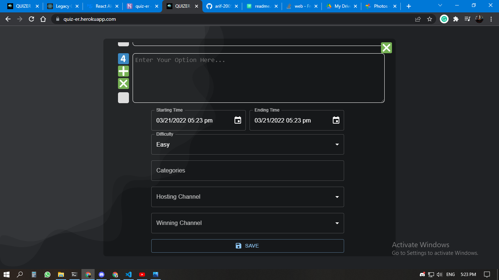
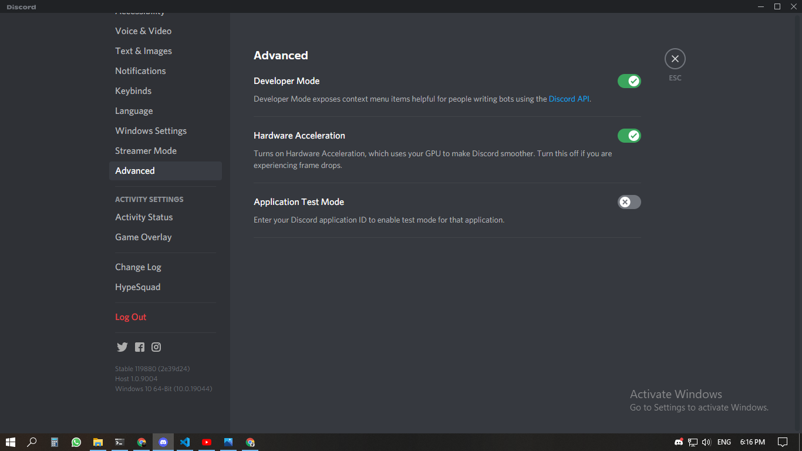

# QUIZER

A premium quality open-source discord bot specially crafted for hosting and managing quizes autometically and punctually.

## Screenshots
**Here are some screenshots of QUIZER Bot.**
<p align="center">








</p>


## Installation

1. Clone this repository or download the zip and unzip.
2. Then install all the necessory packages using the commands in the terminal.
```bash
yarn install
```
3. Then to run the project run this command.
```bash
yarn dev
```
The production build of the frontend is already there in the public folder.
But you can change all the code freely.

**The project is ready to host online.**

## Environment Variables

**To run this project, you will need to add the following environment variables to your .env file**

```
MONGO_URI=<YOUR_MONGODB_URI>
DISCORD_TOKEN=<YOUR_DISCORD_TOKEN>
CLIENT_ID=<YOUR_CLIENT_ID>
CLIENT_SECRET=<YOUR_CLIENT_SECRET>
REDIRECT_URL=<YOUR_REDIRECT_URL>

GUILD_ID=<THE_SERVER_GUILD_ID>
QUIZ_MORDERATOR_ID=<ID_OF_THE_QUIZ_MORDERATOR_ROLE>
QUIZ_LOG_CHANNEL_ID=<THE_ID_OF_THE_CHANNEL_WHERE_ALL_THE_QUIZ_WILL_B_LOGGED>
```

1. **MONGO_URI**
      Provide the mongo db url. This Quizer bot will store all the quizes in this database. You can also provide mongodb atlas uri.
2. **DISCORD_TOKEN**
      Create a discord bot. then copy the Bot Token here to allow the bot to login. You have to add the bot to your server and provide it the Administrator Role.
3. **CLIENT_ID**
      Provide the Client id of your bot
4. **CLIENT_SECRET**
      Provade the Client Secret of your bot
5. **REDIRECT_URL**
      Provide the Redirect Url of your bot. This is the same url of your app.
6. **GUILD_ID**
      Provide the Guild/Server id.
6. **QUIZ_MORDERATOR_ID**
      Provide the id of the role who can host or manage the quizes.
6. **QUIZ_LOG_CHANNEL_ID**
      Provide the id of the channel where all the Quizes will be logged. Hide this from all other members. The quistions along with the answers, update log, delition log will appear here.

### How to get DISCORD_TOKEN, CLIENT_ID, CLIENT_SECRET, GUILD_ID, QUIZ_MORDERATOR_ID and QUIZ_LOG_CHANNEL_ID

To use the QUIZER, you have to create a discord bot.
1. Goto https://discord.com/developers/applications.
2. Create a new application.
3. After creating, go to `Bot` on the left pannel , then click the `Reset Token` and copy the new Token. **This is your DISCORD_TOKEN**.
4. Now goto `OAuth2` on the left pannel, then copy the CLIENT_ID and CLIENT_SECRET.
5. Now add an redirect url. This is the url where your frontend site is hosted. If localhost then `http://localhost:3000`.
6. Now for other three env variables, you have to be in the devloper mode.
      
7. Then right click on your server and copy id. Goto Roles and copy the id of the required role. Then copy the channels id.

Put all the Variables at `.env` file properly. And you are done.


## Authors

- [@CodeWithArif](http://github.com/arif-2005)


